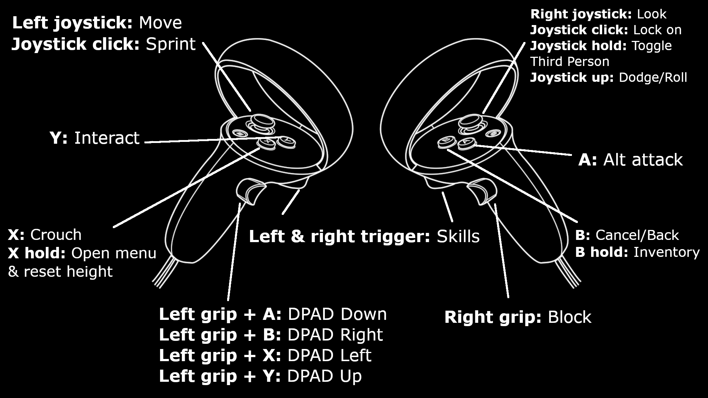

# <b>OutwardVR</b>
<p align="center">
  
</p>

<!-- [![Build Status][travis-image]][travis-url]
[![Downloads Stats][npm-downloads]][npm-url] -->

Currently this mod converts the standard third-person flatscreen Outward game to a first person VR experience with full 6DOF and motion control support.

<br>

## <b>Installation</b>

Before installing the mod, it's important that you have the correct version of Outward installed. This mod will only work on the Definitive Edition, and it must be the Mono version. Follow these steps to install the Mono version:
1. Right click on Outward in your Steam game library and select `Properties`
2. Select the `Betas` tab and under the section that says "Select the beta you would like to opt into:" select `default-mono - Public default branch (mono)` from the dropdown list. 
3. Wait for the download to finish and you now you're ready to install the mod.

After installing the Mono version, to install the mod follow these steps:
1. Download the latest release of the mod which can be found on the right side of the GitHub page for this mod.
2. After downloading, open the game directory by right clicking Outward in your Steam game library and selecting `Properties`.
3. Select the `Local Files` tab and click on the `Browse` button which should open a file explorer at the root of the game. You should see a folder called `Outward_Defed` if you have the definitive edition, open that and move onto the next step.
4. Extract the contents of the zip into the `Outward_Defed` folder, so that the `BepInEx` folder is in the same directory as the `Outward Definitive Edition_Data` folder, and merge or overwrite any files it asks you to, now you should be able to start the game in VR.

<br>

## <b>Controls and how to play</b>
The controls are still a WIP so bare with me if they're hard to use:

- To attack with melee weapons, swing your sword at your target. There is no way to use a secondary attack (B attack) just yet.
- You can block using motion controls, with most weapons holding it to the side parallel with your body will block, shield you need to hold out in front of you, and for fist weapons, you need to hold both fists out in front of you facing upwards. If you don't like the motion controlled blocking though you can use `Right grip` to block instead.
- If you feel your height isn't set properly, hold down the `X` button until the menu opens while standing/sitting at your preferred height to recalibrate.
 

<b>NOTE:</b> Converting this game from a third-person keyboard/gamepad melee experience into a first-person motion controlled experience was challenging, and I had to make a lot of decisions in regards to movement and combat to make it feel more fluid in VR, as well as keeping with the difficulty of the original game, so there will be some things that may not feel right or you might think is stupid, and you may be right, although the mod is mostly done, the combat still requires some fine tuning and any help and/or advice is much appreciated!

<br>

## <b>Development setup</b>

If you want to help with developing this mod or build it yourself, start by downloading the source code, then in a terminal navigate to the source code folder and enter

```sh
dotnet restore ./
```

Then opening with your favourite IDE should be enough to begin developing or building this mod.

<br>

## <b>Release History</b>

* 0.9.0 - Beta version of the mod, mostly works but need community help to fine tune and find and fix bugs.

<br>

## <b>Support</b>
* So far this mod has only been tested on a Quest 2 and with the Oculus Touch controllers. It should work for other VR headsets but it will not work for other VR controllers until you add your own controller mapping scheme.

<br>

## <b>Credits</b>

* Big thanks to [PinkMilkProductions](https://www.youtube.com/channel/UCvZLpwlyxn6lFYXKsBl6qHg) for his Unity VR modding series 
* Thanks to [dabeschte](https://github.com/dabeschte) for his [VR arm inverse kinematics repository](https://github.com/dabeschte/VRArmIK) which I based my IK off

<br>

## <b>Contact</b>

If you want to get in contact with me, please send me an email at cybensis@protonmail.com or find me in the flat2vr Discord.

<!-- Markdown link & img dfn's -->
<!-- [npm-image]: https://img.shields.io/npm/v/datadog-metrics.svg?style=flat-square
[npm-url]: https://npmjs.org/package/datadog-metrics
[npm-downloads]: https://img.shields.io/npm/dm/datadog-metrics.svg?style=flat-square
[travis-image]: https://img.shields.io/travis/dbader/node-datadog-metrics/master.svg?style=flat-square
[travis-url]: https://travis-ci.org/dbader/node-datadog-metrics
[wiki]: https://github.com/yourname/yourproject/wiki -->
